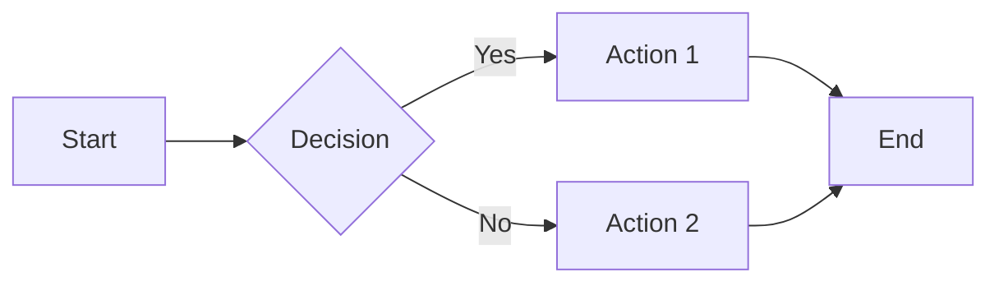

# 📝 Markdown Editor - Professional Guide

> **Markdown Editor** là công cụ đọc, chỉnh sửa và xuất file Markdown với giao diện chuyên nghiệp, hỗ trợ Dark Mode và xuất PDF.

[](https://xuanhvl-learning.github.io/markdown-editor/)
[](LICENSE)

---

## 🚀 Features

- ✅ **Đọc file .md** - Upload và hiển thị Markdown
- ✏️ **Edit Live** - Chỉnh sửa với preview realtime
- 📄 **Export PDF** - Xuất file PDF chất lượng cao
- 💾 **Save .md** - Lưu file Markdown đã chỉnh sửa
- 🌙 **Dark Mode** - Chế độ tối bảo vệ mắt
- 📘 **Vietnamese Guide** - Hướng dẫn tiếng Việt đầy đủ
- 🎨 **Clean UI** - Giao diện sạch đẹp, chuyên nghiệp

---

## 🎯 Quick Start

### Cách 1: Online (Khuyên Dùng)
👉 Truy cập: **[https://xuanhvl-learning.github.io/markdown-editor/](https://xuanhvl-learning.github.io/markdown-editor/)**

### Cách 2: Local
```bash
# Clone repository
git clone https://github.com/xuanhvl-learning/markdown-editor.git

# Mở file trong browser
cd markdown-editor
open index.html  # macOS
start index.html # Windows
```

---

## 📖 Cách Sử Dụng

### 1️⃣ Đọc File Markdown
1. Click **"Choose File"** và chọn file `.md`
2. Click **"READ"** để xem nội dung
3. Scroll để đọc toàn bộ file

### 2️⃣ Chỉnh Sửa File
1. Click **"EDIT"** để chuyển sang chế độ chỉnh sửa
2. Gõ Markdown ở panel bên trái
3. Click **"REVIEW"** để xem kết quả bên phải
4. Click **"SAVE"** để tải file `.md` đã chỉnh sửa

### 3️⃣ Tạo File Mới
1. Click **"NEW FILE"**
2. Bắt đầu viết Markdown
3. Review và Save

### 4️⃣ Xuất PDF
1. Sau khi edit xong, click **"EXPORT PDF"**
2. File PDF sẽ tự động tải xuống

### 5️⃣ Dark Mode
- Click **"🌙 Dark Mode"** để chuyển chế độ tối
- Click **"☀️ Light Mode"** để quay lại chế độ sáng

---

# 🎓 MARKDOWN GUIDE - Hướng Dẫn Chuyên Nghiệp

## 📚 Mục Lục
- [1. Cú Pháp Cơ Bản](#1-cú-pháp-cơ-bản)
- [2. Định Dạng Text](#2-định-dạng-text)
- [3. Danh Sách](#3-danh-sách)
- [4. Links & Images](#4-links--images)
- [5. Code Blocks](#5-code-blocks)
- [6. Bảng](#6-bảng)
- [7. Blockquotes](#7-blockquotes)
- [8. Horizontal Rules](#8-horizontal-rules)
- [9. Task Lists](#9-task-lists)
- [10. Emojis](#10-emojis)
- [11. HTML trong Markdown](#11-html-trong-markdown)
- [12. Metadata (Front Matter)](#12-metadata-front-matter)
- [13. Best Practices](#13-best-practices)
- [14. Templates Chuyên Nghiệp](#14-templates-chuyên-nghiệp)

---

## 1. Cú Pháp Cơ Bản

### Tiêu Đề (Headers)

```markdown
# H1 - Tiêu đề cấp 1 (Lớn nhất)
## H2 - Tiêu đề cấp 2
### H3 - Tiêu đề cấp 3
#### H4 - Tiêu đề cấp 4
##### H5 - Tiêu đề cấp 5
###### H6 - Tiêu đề cấp 6 (Nhỏ nhất)
```

**Kết quả:**
# H1 - Tiêu đề cấp 1
## H2 - Tiêu đề cấp 2
### H3 - Tiêu đề cấp 3

**💡 Best Practice:**
- Chỉ dùng 1 H1 cho cả document (tiêu đề chính)
- H2 cho các sections lớn
- H3, H4 cho subsections
- Luôn có khoảng trống sau dấu `#`

---

## 2. Định Dạng Text

### Basic Formatting

```markdown
**Bold text** hoặc __Bold text__
*Italic text* hoặc _Italic text_
***Bold và Italic*** hoặc ___Bold và Italic___
~~Strikethrough~~ (Gạch ngang)
`Inline code` (Code ngắn)
```

**Kết quả:**
- **Bold text**
- *Italic text*
- ***Bold và Italic***
- ~~Strikethrough~~
- `Inline code`

### Advanced Formatting

```markdown
<u>Underline text</u> (Dùng HTML)
<mark>Highlighted text</mark>
H<sub>2</sub>O (Subscript)
X<sup>2</sup> (Superscript)
```

**Kết quả:**
- <u>Underline text</u>
- <mark>Highlighted text</mark>
- H<sub>2</sub>O
- X<sup>2</sup>

**💡 Pro Tips:**
- Dùng `**bold**` cho từ khóa quan trọng
- Dùng `*italic*` cho nhấn mạnh nhẹ hoặc thuật ngữ nước ngoài
- Dùng `~~strikethrough~~` cho nội dung đã cũ/deprecated

---

## 3. Danh Sách

### Unordered List (Danh sách không thứ tự)

```markdown
- Item 1
- Item 2
  - Sub-item 2.1
  - Sub-item 2.2
    - Sub-sub-item 2.2.1
- Item 3

hoặc dùng * hoặc +:

* Item A
* Item B
+ Item C
```

**Kết quả:**
- Item 1
- Item 2
  - Sub-item 2.1
  - Sub-item 2.2
- Item 3

### Ordered List (Danh sách có thứ tự)

```markdown
1. Bước 1
2. Bước 2
   1. Bước 2.1
   2. Bước 2.2
3. Bước 3

hoặc:

1. Item đầu tiên
1. Item thứ hai (Markdown tự động đánh số)
1. Item thứ ba
```

**Kết quả:**
1. Bước 1
2. Bước 2
   1. Bước 2.1
   2. Bước 2.2
3. Bước 3

**💡 Best Practice:**
- Indent sub-items bằng 2 hoặc 4 spaces
- Dùng ordered list cho các bước tuần tự
- Dùng unordered list cho các items không theo thứ tự

---

## 4. Links & Images

### Links

```markdown
[Text hiển thị](https://example.com)
[Link với title](https://example.com "Title khi hover")
[Reference link][1]

[1]: https://example.com "Định nghĩa reference ở cuối"

<https://auto-link.com> (Tự động tạo link)
```

**Kết quả:**
- [Text hiển thị](https://example.com)
- [Link với title](https://example.com "Title khi hover")

### Images

```markdown


Hoặc dùng reference:
![Alt text][logo]

[logo]: https://via.placeholder.com/150 "Logo"
```

**Kết quả:**


### Images với Link

```markdown
[](link-url)
```

**💡 Pro Tips:**
- Luôn có alt text cho accessibility
- Dùng reference links cho links lặp lại nhiều lần
- Dùng relative paths cho images trong cùng repository

---

## 5. Code Blocks

### Inline Code

```markdown
Dùng `console.log()` để debug code.
```

**Kết quả:** Dùng `console.log()` để debug code.

### Code Block với Syntax Highlighting

````markdown
```javascript
function greet(name) {
  console.log(`Hello, ${name}!`);
}
greet("World");
```

```python
def greet(name):
    print(f"Hello, {name}!")
    
greet("World")
```

```css
.container {
  max-width: 1200px;
  margin: 0 auto;
}
```
````

**Kết quả:**
```javascript
function greet(name) {
  console.log(`Hello, ${name}!`);
}
greet("World");
```

### Code Block với Line Numbers

````markdown
```javascript {.line-numbers}
function fibonacci(n) {
  if (n <= 1) return n;
  return fibonacci(n - 1) + fibonacci(n - 2);
}
```
````

**💡 Pro Tips:**
- Luôn chỉ rõ ngôn ngữ để có syntax highlighting
- Supported languages: javascript, python, java, css, html, bash, sql, json, yaml, markdown...
- Dùng 3 backticks (```) không 4 để tránh lỗi

---

## 6. Bảng

### Basic Table

```markdown
| Header 1 | Header 2 | Header 3 |
|----------|----------|----------|
| Row 1    | Data     | Data     |
| Row 2    | Data     | Data     |
```

**Kết quả:**
| Header 1 | Header 2 | Header 3 |
|----------|----------|----------|
| Row 1    | Data     | Data     |
| Row 2    | Data     | Data     |

### Table với Alignment

```markdown
| Left Align | Center Align | Right Align |
|:-----------|:------------:|------------:|
| Left       | Center       | Right       |
| Text       | Text         | 1000        |
| ABC        | DEF          | 2500        |
```

**Kết quả:**
| Left Align | Center Align | Right Align |
|:-----------|:------------:|------------:|
| Left       | Center       | Right       |
| Text       | Text         | 1000        |
| ABC        | DEF          | 2500        |

### Table với Formatting

```markdown
| Feature | Status | Priority |
|---------|--------|----------|
| **Login** | ✅ Done | 🔴 High |
| **Search** | ⏳ In Progress | 🟡 Medium |
| *Analytics* | ❌ Todo | 🟢 Low |
```

**Kết quả:**
| Feature | Status | Priority |
|---------|--------|----------|
| **Login** | ✅ Done | 🔴 High |
| **Search** | ⏳ In Progress | 🟡 Medium |
| *Analytics* | ❌ Todo | 🟢 Low |

**💡 Best Practice:**
- `:---` = Left align (default)
- `:---:` = Center align
- `---:` = Right align
- Dùng emojis để table dễ đọc hơn
- Align numbers về bên phải

---

## 7. Blockquotes

### Basic Quote

```markdown
> This is a blockquote.
> It can span multiple lines.
```

**Kết quả:**
> This is a blockquote.
> It can span multiple lines.

### Nested Quotes

```markdown
> Level 1 quote
>> Level 2 nested quote
>>> Level 3 nested quote
```

**Kết quả:**
> Level 1 quote
>> Level 2 nested quote
>>> Level 3 nested quote

### Quote với Formatting

```markdown
> **Note:** This is important!
> 
> You can use *formatting* inside quotes:
> - List item 1
> - List item 2
> 
> ```javascript
> console.log("Even code blocks!");
> ```
```

**Kết quả:**
> **Note:** This is important!
> 
> You can use *formatting* inside quotes:
> - List item 1
> - List item 2

**💡 Use Cases:**
- Trích dẫn từ nguồn khác
- Highlight notes quan trọng
- Warnings, tips, errors

---

## 8. Horizontal Rules

```markdown
---
(3 dashes)

***
(3 asterisks)

___
(3 underscores)
```

**Kết quả:**
---

**💡 Best Practice:**
- Dùng `---` (consistent và dễ nhìn nhất)
- Thêm dòng trống trước và sau horizontal rule
- Dùng để phân tách sections lớn

---

## 9. Task Lists

```markdown
- [x] Task đã hoàn thành
- [x] Task đã done
- [ ] Task đang làm
- [ ] Task chưa làm
  - [ ] Sub-task 1
  - [x] Sub-task 2 (done)
```

**Kết quả:**
- [x] Task đã hoàn thành
- [x] Task đã done
- [ ] Task đang làm
- [ ] Task chưa làm

**💡 Use Cases:**
- Project roadmap
- Todo lists
- Checklist trong documentation

---

## 10. Emojis

### Cách 1: Unicode Emoji

```markdown
😀 😃 😄 😁 🎉 🚀 ⚡ ✅ ❌ 💡 📝 🔥
```

**Kết quả:** 😀 😃 😄 😁 🎉 🚀 ⚡ ✅ ❌ 💡 📝 🔥

### Cách 2: Emoji Shortcodes (GitHub)

```markdown
:smile: :rocket: :fire: :bulb: :tada: :warning:
```

**Kết quả (trên GitHub):**
:smile: :rocket: :fire: :bulb: :tada: :warning:

### Emoji cho Status

```markdown
✅ Done
⏳ In Progress
❌ Cancelled
🔴 High Priority
🟡 Medium Priority
🟢 Low Priority
```

**💡 Emoji Library:**
- 👉 [Emojipedia](https://emojipedia.org)
- 👉 [GitHub Emoji Cheat Sheet](https://github.com/ikatyang/emoji-cheat-sheet)

---

## 11. HTML trong Markdown

Markdown hỗ trợ HTML nếu cần thêm customization:

```markdown
<div align="center">
  <h1>Centered Title</h1>
  <p>This paragraph is centered</p>
</div>

<details>
<summary>Click to expand</summary>

Hidden content here!
- Item 1
- Item 2

</details>

<kbd>Ctrl</kbd> + <kbd>C</kbd> (Keyboard keys)

<mark>Highlighted text</mark>
```

**Kết quả:**

<details>
<summary>Click to expand</summary>

Hidden content here!
- Item 1
- Item 2

</details>

**💡 Use Cases:**
- Collapsible sections với `<details>`
- Center content với `<div align="center">`
- Keyboard shortcuts với `<kbd>`
- Complex layouts

---

## 12. Metadata (Front Matter)

Dùng cho static site generators (Jekyll, Hugo, etc.):

```yaml
---
title: "Document Title"
author: "Your Name"
date: 2025-10-31
tags: [markdown, guide, tutorial]
category: documentation
description: "A comprehensive guide to Markdown"
---

# Content starts here...
```

**💡 Use Cases:**
- Blog posts
- Documentation sites
- GitHub Pages
- Static site generators

---

## 13. Best Practices

### ✅ Structure

1. **Một H1 duy nhất** (tiêu đề chính)
2. **Hierarchy rõ ràng:** H1 → H2 → H3 (không skip levels)
3. **Dòng trống:** Thêm dòng trống giữa các sections
4. **80-100 characters/line** cho readability

### ✅ Formatting

```markdown
✅ GOOD:
- Clear spacing
- Consistent formatting
- Proper hierarchy

❌ BAD:
-No spacing
-Inconsistent style
-Poor hierarchy
```

### ✅ Lists

```markdown
✅ GOOD:
1. First item
2. Second item
3. Third item

❌ BAD:
1. First item
2.Second item (no space)
3.  Third item (extra space)
```

### ✅ Links

```markdown
✅ GOOD:
[Descriptive Link Text](url)

❌ BAD:
[Click here](url)
[Link](url)
```

### ✅ Code

```markdown
✅ GOOD:
```javascript
// Well-formatted code
function example() {
  return true;
}
```

❌ BAD:
```
function example(){return true;}
```
```

### ✅ Tables

```markdown
✅ GOOD:
| Name | Age | City |
|------|----:|------|
| John |  25 | NYC  |

❌ BAD:
|Name|Age|City|
|---|---|---|
|John|25|NYC|
(Khó đọc, không alignment)
```

---

## 14. Templates Chuyên Nghiệp

### 📄 Template 1: README.md Project

```markdown
# Project Name

> Short description of your project

[](link)
[](link)

## 🚀 Features

- Feature 1
- Feature 2
- Feature 3

## 📦 Installation

```bash
npm install your-package
```

## 🎯 Quick Start

```javascript
const example = require('your-package');
example.doSomething();
```

## 📖 Documentation

Full documentation available at [link](url)

## 🤝 Contributing

Contributions welcome! Please read [CONTRIBUTING.md](link)

## 📝 License

MIT © [Your Name](link)
```

---

### 📝 Template 2: Blog Post

```markdown
---
title: "Article Title"
date: 2025-10-31
author: "Your Name"
tags: [tag1, tag2]
---

# Article Title

> TL;DR: Brief summary of the article

## Introduction

Opening paragraph...

## Main Content

### Section 1

Content...

### Section 2

Content...

## Conclusion

Closing thoughts...

---

**References:**
1. [Source 1](url)
2. [Source 2](url)
```

---

### 📋 Template 3: Meeting Notes

```markdown
# Meeting Notes - [Date]

**Attendees:** Name1, Name2, Name3
**Duration:** 60 minutes
**Location:** Office / Zoom

## 🎯 Agenda

1. Topic 1
2. Topic 2
3. Topic 3

## 📝 Discussion

### Topic 1
- Point 1
- Point 2

### Topic 2
- Decision made: ...
- Action items:
  - [ ] Task 1 (@Person1, Due: Date)
  - [ ] Task 2 (@Person2, Due: Date)

## ✅ Action Items Summary

| Task | Owner | Due Date | Status |
|------|-------|----------|--------|
| Task 1 | @Person1 | 2025-11-01 | ⏳ In Progress |
| Task 2 | @Person2 | 2025-11-05 | ❌ Not Started |

## 📅 Next Meeting

**Date:** [Next meeting date]
**Topics:** [Topics to discuss]
```

---

### 📊 Template 4: Technical Documentation

```markdown
# API Documentation

## Overview

Brief description of the API.

## Authentication

```bash
curl -H "Authorization: Bearer YOUR_TOKEN" \
  https://api.example.com/endpoint
```

## Endpoints

### GET /users

**Description:** Retrieve list of users

**Parameters:**
| Parameter | Type | Required | Description |
|-----------|------|----------|-------------|
| page | integer | No | Page number |
| limit | integer | No | Items per page |

**Response:**
```json
{
  "users": [
    {
      "id": 1,
      "name": "John Doe",
      "email": "john@example.com"
    }
  ],
  "total": 100
}
```

**Example:**
```bash
curl https://api.example.com/users?page=1&limit=10
```

### POST /users

**Description:** Create new user

**Request Body:**
```json
{
  "name": "Jane Doe",
  "email": "jane@example.com"
}
```

**Response:**
```json
{
  "id": 2,
  "name": "Jane Doe",
  "email": "jane@example.com",
  "created_at": "2025-10-31T10:00:00Z"
}
```

## Error Codes

| Code | Description |
|------|-------------|
| 400 | Bad Request |
| 401 | Unauthorized |
| 404 | Not Found |
| 500 | Internal Server Error |
```

---

### 🎓 Template 5: Tutorial/Guide

```markdown
# How to [Do Something] - Complete Guide

> **Level:** Beginner | **Time:** 30 minutes

## 📋 Prerequisites

Before starting, you need:
- [ ] Requirement 1
- [ ] Requirement 2
- [ ] Requirement 3

## 🎯 What You'll Learn

By the end of this tutorial, you will:
- ✅ Skill 1
- ✅ Skill 2
- ✅ Skill 3

## 🚀 Step-by-Step Guide

### Step 1: Setup

First, do this...

```bash
command here
```

**Expected output:**
```
output here
```

### Step 2: Implementation

Next, implement...

```javascript
code here
```

**Explanation:** This code does...

### Step 3: Testing

Test your implementation:

```bash
test command
```

## 💡 Tips & Tricks

- **Tip 1:** Explanation
- **Tip 2:** Explanation

## ⚠️ Common Issues

### Issue 1: Error Message

**Cause:** Explanation

**Solution:**
```bash
fix command
```

### Issue 2: Another Error

**Cause:** Explanation

**Solution:** Step-by-step fix

## 🎉 Conclusion

Congratulations! You've learned...

## 📚 Further Reading

- [Resource 1](url)
- [Resource 2](url)
```

---

### 💼 Template 6: Project Proposal

```markdown
# Project Proposal: [Project Name]

**Date:** 2025-10-31
**Prepared by:** Your Name
**Status:** 🟡 Draft / 🟢 Approved

## 📋 Executive Summary

Brief overview (2-3 sentences) of what this project is about.

## 🎯 Objectives

1. Objective 1
2. Objective 2
3. Objective 3

## 📊 Current Situation

### Problem Statement

Describe the problem...

### Impact

- Impact 1
- Impact 2

## 💡 Proposed Solution

### Approach

Detailed explanation of the solution...

### Key Features

1. **Feature 1:** Description
2. **Feature 2:** Description
3. **Feature 3:** Description

## 📅 Timeline

| Phase | Duration | Deliverables |
|-------|----------|--------------|
| Planning | 2 weeks | Requirements doc |
| Development | 6 weeks | Working prototype |
| Testing | 2 weeks | Test reports |
| Launch | 1 week | Production release |

**Total Duration:** 11 weeks

## 💰 Budget Estimate

| Item | Cost |
|------|-----:|
| Development | $XX,XXX |
| Infrastructure | $X,XXX |
| Marketing | $X,XXX |
| **Total** | **$XX,XXX** |

## 👥 Team & Resources

| Role | Name | Allocation |
|------|------|-----------|
| Project Manager | Name | 100% |
| Developer | Name | 100% |
| Designer | Name | 50% |

## ⚠️ Risks & Mitigation

| Risk | Impact | Probability | Mitigation |
|------|--------|-------------|------------|
| Risk 1 | High | Low | Strategy |
| Risk 2 | Medium | Medium | Strategy |

## ✅ Success Metrics

- KPI 1: Target
- KPI 2: Target
- KPI 3: Target

## 📝 Next Steps

1. [ ] Get approval from stakeholders
2. [ ] Finalize budget
3. [ ] Assemble team
4. [ ] Kick-off meeting

## 📎 Appendix

- [Attachment 1](link)
- [Attachment 2](link)
```

---

## 🎨 Markdown Styling Tips

### Use Badges

```markdown


```

### Use Diagrams (Mermaid)

```markdown

```

### Use Footnotes

```markdown
Here's a sentence with a footnote[^1].

[^1]: This is the footnote content.
```

---

## 🔗 Useful Resources

### Documentation
- 📖 [Markdown Guide](https://www.markdownguide.org)
- 📖 [GitHub Markdown](https://guides.github.com/features/mastering-markdown/)
- 📖 [CommonMark Spec](https://commonmark.org)

### Tools
- 🛠️ [Dillinger](https://dillinger.io) - Online Markdown Editor
- 🛠️ [StackEdit](https://stackedit.io) - Browser Markdown Editor
- 🛠️ [Typora](https://typora.io) - Desktop Markdown Editor

### Converters
- 🔄 [Pandoc](https://pandoc.org) - Convert Markdown to PDF, DOCX, etc.
- 🔄 [Markdown to PDF](https://www.markdowntopdf.com)

---

## 📞 Support

- 🐛 [Report Bug](https://github.com/xuanhvl-learning/markdown-editor/issues)
- 💡 [Request Feature](https://github.com/xuanhvl-learning/markdown-editor/issues)
- 📧 Email: your-email@example.com

---

## 📝 License

MIT © 2025 Huynh Phu Xuan

---

## 🙏 Acknowledgments

Special thanks to:
- Markdown creators
- Open source community
- Contributors

---

**Made with ❤️ by [Huynh Phu Xuan](https://github.com/xuanhvl-learning)**

**Last Updated:** October 31, 2025
